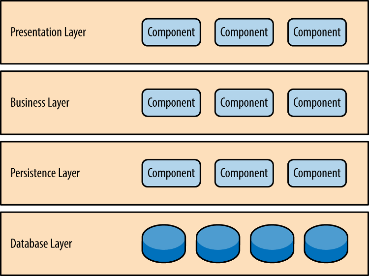
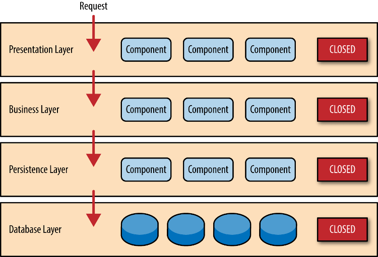

### 架构设计

  - 分层架构（layered architecture）是本小程序采用的架构。这种架构将软件分成若干个水平层，每一层都有清晰的角色和分工，不需要知道其他层的细节。层与层之间通过接口通信。本小程序采用四层的结构。

  - 表现层（presentation）：用户界面，负责视觉和用户互动
  - 业务层（business）：实现业务逻辑
  - 持久层（persistence）：提供数据
  - 数据库（database） ：保存数据

  - 在逻辑层和持久层之间，我们加了一个服务层（service），提供不同业务逻辑需要的一些通用接口。用户的请求将依次通过这四层的处理，不能跳过其中任何一层。

  - 优点
  - 结构简单，容易理解和开发
  - 不同技能的程序员可以分工，负责不同的层
  - 每一层都可以独立测试，其他层的接口通过模拟解决

  - 缺点
  - 一旦环境变化，需要代码调整或增加功能时，通常比较麻烦和费时
  - 部署比较麻烦，即使只修改一个小地方，往往需要整个软件重新部署，不容易做持续发布
  - 软件升级时，可能需要整个服务暂停
  - 扩展性差，用户请求大量增加时，必须依次扩展每一层，由于每一层内部是耦合的，扩展会很困难
