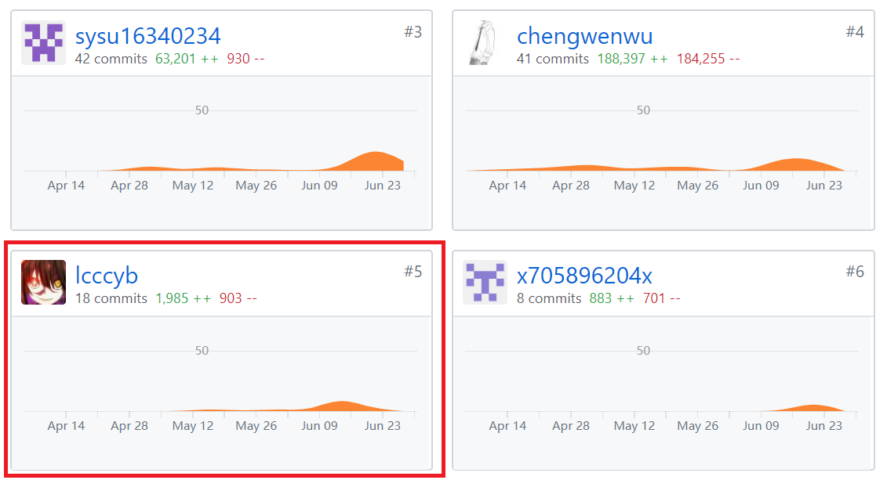

# 16340042 lcccyb Final Report

## 个人小结

这个项目算是自进入大学以来第一次贯穿了几乎一整个学期的大项目，首先我们确定了项目主题，运用理论课所学到的建模方法书写文档，建立相应的数据库。这次项目我们采用的是微信小程序的框架实现，在此之前我并没有接触过微信小程序的开发（甚至网页开发相关都没怎么接触过，因为之前没有选过web课），所以wxml，wxss，以及js语法需要一步步学起。另外，还用到了微信小程序的云开发，相比于手动创建数据库以及创建调用函数，云开发提供了云存储和数据库访问的相关API，数据库创建只需要在云开发条目上输入相应项目，非常方便。通过这次项目，我学习了微信小程序框架相关技术和web相关技术，同时也体会到团队协调管理的重要性及其难度，受益匪浅。

## PSP2.1统计表

|                                       | Personal Software Process Stages         | Time (%) |
| ------------------------------------- | ---------------------------------------- | -------- |
| **Planning**                          | **计划**                                 | **10**   |
| estimate                              | 预估任务时间                             | 10       |
| **Development**                       | **开发**                                 | 85       |
| analysis                              | 需求分析                                 | 5        |
| design spec                           | 生成设计文档                             | 5        |
| estimate                              | 设计复审（与前端团队成员审核设计文档）   | 10       |
| coding standard                       | 代码规范                                 | 5        |
| design                                | 具体设计，包括绘制 UI，设计架构等        | 15       |
| coding                                | 具体编码                                 | 25       |
| code review                           | 代码复审                                 | 5        |
| test                                  | 测试（修改代码）                         | 15       |
| **Report**                            | **报告**                                 | 10       |
| test report                           | 测试报告                                 | 1        |
| size measurement                      | 计算工作量                               | 1        |
| postmortem & process improvement plan | 每次迭代结束后写总结文档，并提出改进计划 | 3        |

## 在项目相关仓库中的贡献

## 个人博客清单

[以太坊开发入门](https://lcccyb.cc/study/2018/10/30/%E4%BB%A5%E5%A4%AA%E5%9D%8A%E5%BC%80%E5%8F%91%E5%85%A5%E9%97%A8/)

[以太坊客户端Geth命令用法-参数详解](https://lcccyb.cc/study/2018/10/31/%E4%BB%A5%E5%A4%AA%E5%9D%8A%E5%AE%A2%E6%88%B7%E7%AB%AFGeth%E5%91%BD%E4%BB%A4%E7%94%A8%E6%B3%95-%E5%8F%82%E6%95%B0%E8%AF%A6%E8%A7%A3/)