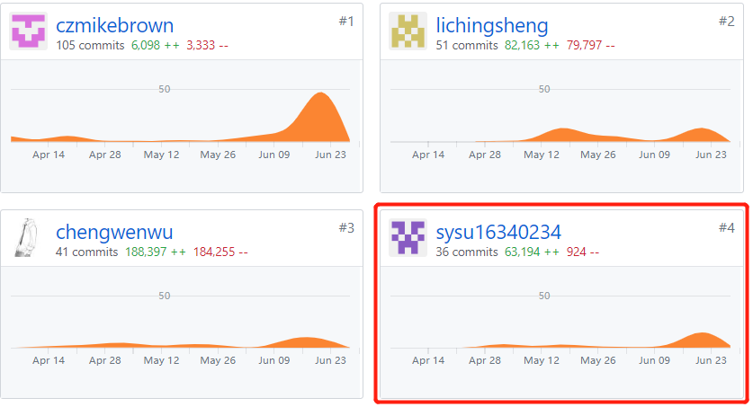

# 16340234 WYS Final Report

## 个人小结

本次项目锻炼了我的软件设计能力,团队沟通能力,本次项目把理论课上所学到的建模方法运用到实战中,并且深刻意识到了合适的软件开发过程的重要性和必要性,同时也学习到了一些
之前没有接触过的新技术,比如微信小程序的框架以及部署nodejs服务器,同时也体会到了,在团队项目中,个人的影响力是有限的,团队的沟通和配合非常重要;

## PSP2.1统计表

|                                       | Personal Software Process Stages         | Time (%) |
| ------------------------------------- | ---------------------------------------- | -------- |
| **Planning**                          | **计划**                                 | **5**   |
| estimate                              | 预估任务时间                             | 5       |
| **Development**                       | **开发**                                 | **90**   |
| analysis                              | 需求分析                                 | 5       |
| design spec                           | 生成设计文档                             | 10        |
| estimate                              | 设计复审（与前端团队成员审核设计文档）   | 10       |
| coding standard                       | 代码规范                                 | 5        |
| design                                | 具体设计，包括绘制 UI，设计架构等        | 20       |
| coding                                | 具体编码                                 | 20       |
| code review                           | 代码复审                                 | 5        |
| test                                  | 测试（修改代码）                         | 15       |
| **Report**                            | **报告**                                 | 10       |
| test report                           | 测试报告                                 | 1        |
| size measurement                      | 计算工作量                               | 1        |
| postmortem & process improvement plan | 每次迭代结束后写总结文档，并提出改进计划 | 3        |

## 在项目相关仓库中的贡献

## 个人博客清单

