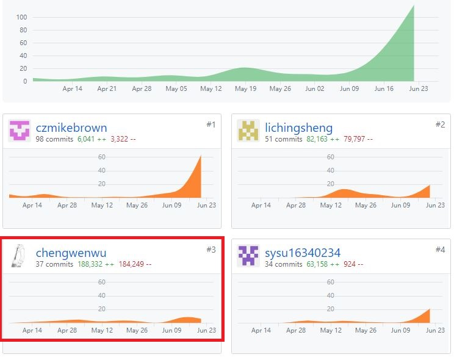

# 16340236 chengwenwu Final Report

## 1、个人小结

 通过本次小组项目，我有一下收获：

①知道了前端的flex布局方法，进一步强化了前端知识

②了解了微信云开发的使用方法，以及云存储和数据库访问的相关API

③知道了微信云函数的编写方法以及权限管理。

④体会到团队协调管理的重要性及其难度。

⑤知道了如何多人共享github仓库，以及出现版本混乱时，回退及其它处理办法。

⑥学会了使用gitpage编写静态项目文档。

⑦体验了从获取需求，到设计，开发，测试的整个开发流程。

⑧看到了前后端分离的原因及其好处。

## 2、PSP2.1统计表

|                                       | Personal Software Process Stages         | Time (%) |
| ------------------------------------- | ---------------------------------------- | -------- |
| **Planning**                          | **计划**                                 | **10**   |
| estimate                              | 预估任务时间                             | 10       |
| **Development**                       | **开发**                                 | 85       |
| analysis                              | 需求分析                                 | 10       |
| design spec                           | 生成设计文档                             | 5        |
| estimate                              | 设计复审（与前端团队成员审核设计文档）   | 10       |
| coding standard                       | 代码规范                                 | 2        |
| design                                | 具体设计，包括绘制 UI，设计架构等        | 15       |
| coding                                | 具体编码                                 | 22       |
| code review                           | 代码复审                                 | 5        |
| test                                  | 测试（修改代码）                         | 15       |
| **Report**                            | **报告**                                 | 10       |
| test report                           | 测试报告                                 | 1        |
| size measurement                      | 计算工作量                               | 1        |
| postmortem & process improvement plan | 每次迭代结束后写总结文档，并提出改进计划 | 8        |

## 3、在项目相关仓库中的贡献

## 4、个人博客清单

- [如何用github page搭建个人网站](https://blog.csdn.net/C2681595858/article/details/88066862)
- [用gitpage为自己的项目编写文档](https://blog.csdn.net/C2681595858/article/details/88068065)
- [git常用命令](https://blog.csdn.net/C2681595858/article/details/90578223)

## 5、特别致谢

- 特别感谢小组内其它小伙伴的紧密配合，齐心协力完成项目。

  